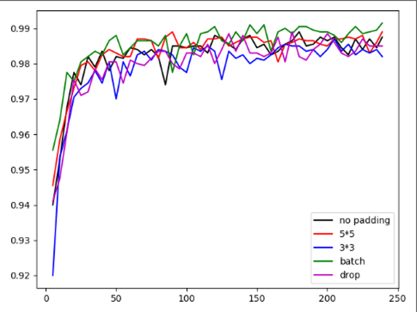

# CNN-MNIST-Pytorch

a simple mnist classification with pytorch using Convolutional NeuralNetwork and NeuralNetwork.

### Dependencies
* python 3.6 +

* pytorch 1.0 +

* logging

* torchvision

* matplotlib

### Some results

**Performance**

Results of some comparative tests.

|Model |Accuracy  |Loss  |
|----|-----| -----|
| NN(NeuralNetwork) | 95.33% | 0.1687 |
| CNN with 5*5 kernel | 98.75% | 0.0065 |
| CNN with 3*3 kernel + padding | 98.20% | 0.0038 |
| CNN with 5*5 kernel + padding | 98.90% | 0.0167 |
| CNN with 5*5 kernel + BatchNorm2d | 99.15% | 0.0001 |
| CNN with 5*5 kernel + dropout | 98.50% | 0.0302 |

**Test on realistic image**

